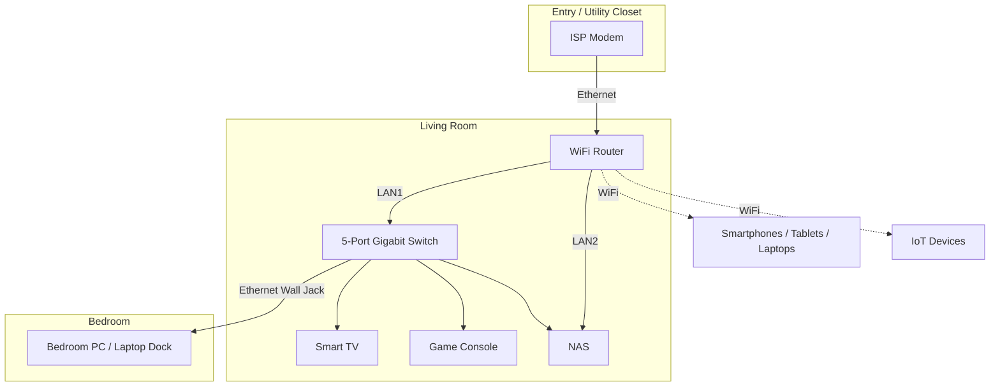
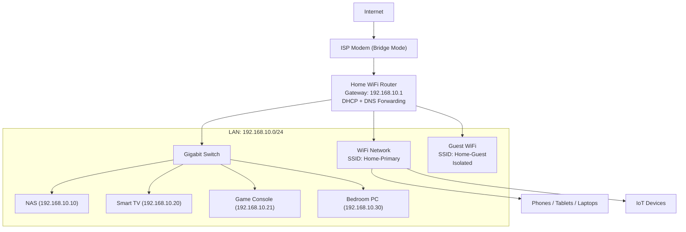

# Network Documentation – 1B1B Apartment

---

# 1. Physical Topology

## 1.1 Apartment Layout Overview
This documentation describes the network setup for a typical 1 Bedroom / 1 Bathroom apartment.  
Main areas include:
- Entry / Utility Closet  
- Living Room  
- Bedroom  
- Kitchen  
- Bathroom  

## 1.2 Physical Device Locations

### ISP Modem
- Location: Entry area or utility closet  
- Connection: ISP line → Modem WAN  

### Main WiFi Router
- Location: Living room TV stand  
- Connections:
  - WAN → Modem LAN  
  - LAN1 → Switch  
  - LAN2 → NAS  
- Wireless Coverage: Living room, kitchen, partial bedroom  

### Switch (5‑port Gigabit)
- Location: Living room TV stand  
- Connections:
  - Port 1 → Router LAN1  
  - Port 2 → Smart TV  
  - Port 3 → Game Console  
  - Port 4 → Bedroom wall Ethernet jack  
  - Port 5 → NAS  

### Bedroom Devices
- Wall Ethernet jack → PC / Laptop Dock  
- WiFi for mobile devices  

### Wireless Devices
- Smartphones, tablets, laptops  
- Smart speakers  
- Smart bulbs, plugs, IoT devices  

## 1.3 Physical Topology Diagram

---

# 2. Logical Topology

## 2.1 Network Structure
- Topology Type: Star topology  
- Core Device: Home WiFi Router  
- Upstream: Router WAN → ISP Modem → Internet  
- Downstream:
  - Wired: Switch, NAS, Smart TV, Game Console, Bedroom PC  
  - Wireless: Phones, laptops, tablets, IoT devices  

## 2.2 Subnet and Addressing
- Primary LAN Subnet: 192.168.10.0/24  
- Default Gateway: 192.168.10.1  
- DHCP Range: 192.168.10.100–192.168.10.199  
- Static IP Range: 192.168.10.2–192.168.10.50  

## 2.3 VLAN Design
- VLAN 10 – Main devices  
- VLAN 20 – IoT devices  
- VLAN 30 – Guest WiFi  
- VLANs are not currently deployed but reserved for future expansion.  

## 2.4 Logical Topology Diagram

---

# 3. Addressing Documentation

## 3.1 Network Information
- Subnet: 192.168.10.0/24  
- Gateway: 192.168.10.1  
- Subnet Mask: 255.255.255.0  
- DNS Servers:
  - Primary: 1.1.1.1  
  - Secondary: 8.8.8.8  

## 3.2 DHCP Pool
- Range: 192.168.10.100–192.168.10.199  
- Lease Time: 24 hours  

## 3.3 Static IP Assignments

| Device        | Role/Use            | IP Address      | MAC Address | Location | Notes |
|---------------|----------------------|------------------|-------------|----------|-------|
| Router        | Gateway/DHCP/DNS     | 192.168.10.1     | AA:AA:AA... | Living Room | LAN interface |
| NAS           | Storage/Media        | 192.168.10.10    | BB:BB:BB... | Living Room | Static IP |
| Smart TV      | Streaming            | 192.168.10.20    | CC:CC:CC... | Living Room | DHCP reservation |
| Game Console  | Gaming               | 192.168.10.21    | DD:DD:DD... | Living Room | Port forwarding |
| Bedroom PC    | Work/Entertainment   | 192.168.10.30    | EE:EE:EE... | Bedroom | Wired |

## 3.4 DHCP Devices

| Device       | Connection | IP Range Example        | Notes |
|--------------|------------|--------------------------|-------|
| Smartphone   | WiFi       | 192.168.10.100–120       | DHCP |
| Laptop       | WiFi       | 192.168.10.121–140       | DHCP |
| Tablet       | WiFi       | 192.168.10.141–160       | DHCP |
| Smart Speaker| WiFi       | 192.168.10.161–180       | DHCP |

---

# 4. Network Devices & Services

## 4.1 Core Network Devices

### ISP Modem
- Converts ISP signal to Ethernet  
- Operates in bridge mode  

### WiFi Router
- NAT, routing  
- DHCP server  
- DNS forwarding  
- Dual-band WiFi (2.4GHz/5GHz)  
- Optional Guest WiFi  

### Gigabit Switch (5-port)
- Expands wired connectivity  
- Unmanaged, plug-and-play  

## 4.2 End Devices and Services

### NAS
- File sharing (SMB/NFS)  
- Backup storage  
- Optional media server  

### Smart TV
- Streaming services  
- Wired connection  

### Game Console
- Online gaming  
- Wired connection  

### Bedroom PC
- Work and entertainment  
- Wired via bedroom Ethernet jack  

### Wireless Devices
- Phones, tablets, laptops  
- Smart speakers, IoT devices  

---

# 5. Device Configurations

## 5.1 Router Configuration

### WAN
- Connection type: DHCP (ISP assigned)  
- DNS override: 1.1.1.1 / 8.8.8.8  

### LAN
- IP: 192.168.10.1  
- Mask: 255.255.255.0  

### DHCP
- Range: 192.168.10.100–199  
- Reservations:
  - NAS → 192.168.10.10  
  - TV → 192.168.10.20  
  - Console → 192.168.10.21  
  - PC → 192.168.10.30  

## 5.2 WiFi Configuration

### Primary SSID
- Name: Home-Primary  
- Security: WPA2/WPA3-Personal  
- Password stored in password manager  

### Guest SSID
- Name: Home-Guest  
- Client isolation enabled  
- No access to internal LAN  

## 5.3 Port Forwarding
- Game Console:
  - External Port: 3074  
  - Internal IP: 192.168.10.21  
  - Protocol: TCP/UDP  

## 5.4 Firewall Rules
- LAN → WAN: Allow  
- WAN → LAN: Deny (except established connections)  
- Guest network blocked from 192.168.10.0/24  
- IoT devices restricted from accessing NAS/PC  

---

# 6. Secure Credential Storage

## 6.1 Password Management Principles
- No plaintext passwords in documentation  
- All credentials stored in a password manager:
  - Bitwarden / 1Password / KeePass  

## 6.2 Password Policy
- Minimum 12 characters  
- Mixed character types  
- No password reuse  
- Router admin password rotated every 6–12 months  

## 6.3 Multi-Factor Authentication (MFA)
Enabled for:
- Password manager account  
- NAS remote access  
- Important cloud services  

## 6.4 Backup & Recovery
- Master password stored on secure physical medium  
- Avoid:
  - Sticky notes on router  
  - Passwords in desktop text files  
  - Credentials in GitHub repositories  
